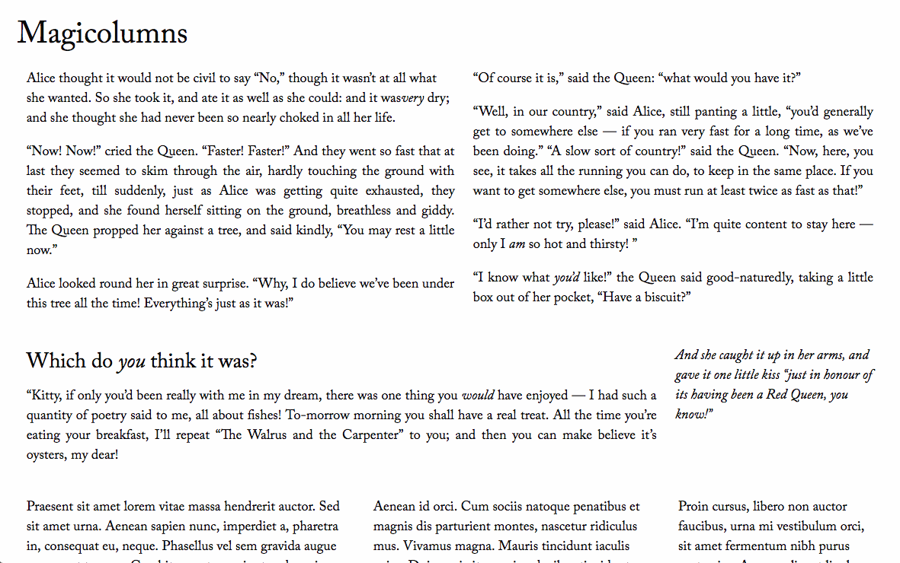
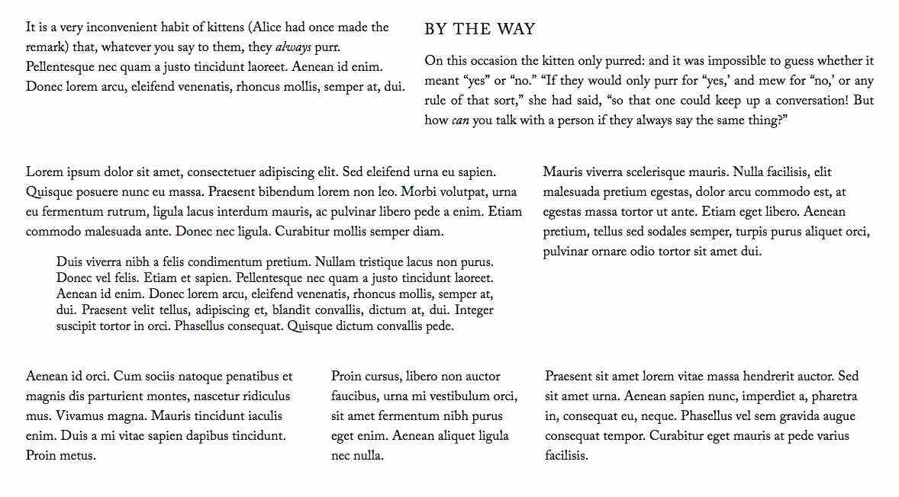

# Magicolumns!

Columns of text that stretch to fit, with easy-to-use shortcodes, for WordPress.

Easy to use and set up. After installing the plugin you can jump right in to using the shortcodes in the page/post editor.

Wrap around a region of text to create a container:
`[mgc][/mgc]`

Wrap around each element you'd like to be a column:
`[col][/col]`

This plugin creates a responsive layout. At small sizes (e.g. phones) the layout defaults to your theme's styles. The Magicolumns kick in at medium or larger sizes (tablets, laptops, desktops, etc).

_Not recommended for use with fixed-layout (not responsive) themes._

