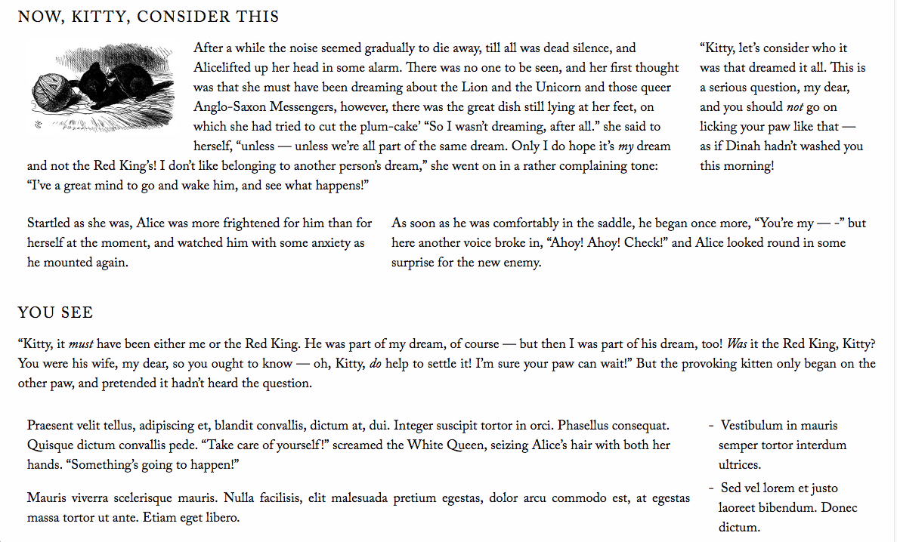

#Lightweight Columns

WordPress shortcodes for simple, responsive columns. Includes thirds, halves, and three-column flowing text.

No installation needed. Just jump right in to using the shortcodes in the page/post editor.
These shortcodes work in pairs, so be sure to use the couples together in the proper way. Do not "mix-and-match".

##Shortcodes

`[half_first][/half_first]`

`[half_last][/half_last]`

`[twothirds_first][/twothirds_first]`

`[onethird_last][/onethird_last]`

`[onethird_first][/onethird_first]`

`[twothirds_last][/twothirds_last]`

`[threecolumns][/threecolumns]`